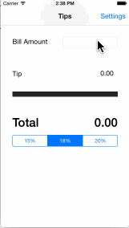

# tips
CodePath iOS Bootcamp - Tip Calculator

This is a Tip Calculator application for iOS submitted as the [pre-assignment](https://gist.github.com/timothy1ee/7747214) requirement for Codepath.

Time spent: 2 hours

Completed:

* [x] Required: User can enter a bill amount, choose a tip percentage, and see the tip and total values.
* [ ] Required: Settings page to change the default tip percentage. (WIP)

GIF created with [LiceCap](http://www.cockos.com/licecap/)
